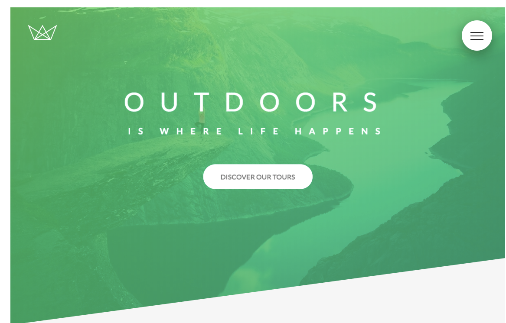
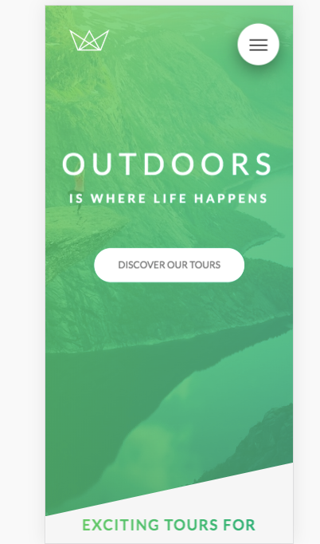

# Natours

This is an advanced CSS and Sass project.

### Planning:
1. BEM naming conventions 
[Read More About BEM](http://getbem.com/naming/)
2. 7-1 Scss Architecture
3. Grid System
4. Feature cards
5. HTML video element
6. pseduo-elements
7. General and adjacent sibling selectors
8. Top down approach and return to the top.

### Execution:
1. Header 
2. Grid System established
3. About Section
4. Features Section
5. Tour Section
6. Stories Section
7. Booking Section
8. Footer Section
9. Navigation
10. Popup
11. Adding media queries 

### Advanced CSS and Sass Concepts used:
1. Overall
	* rems 
	
2. Header
	* clip path
	* transform/translate
	* advanced animations 

3. About Section
	* grid system
	* image quality

4. Features Section
	* icon fonts
	* direct child selector

5. Tour Section
	* cards/ flip cards

6. Stories Section 
	* HTML video element
	* filter images
	* background video

7. Booking Section

8. Footer

9. Navigation
	* checbox hack
	* custom animations timing functions using cubic bezier curves
	* solid color graidents

10. CSS PopUP
	* display: table cell
	* target pseudo class
	* columns

### Responsive Design Notes
**Desktop first vs Mobile first**

Write CSS code for mobile vs desktop first. With desktop you write large and 
srink. Mobile first is the reverse. As more and more users are on thier mobiles,
mobile first is the better approach. You should always keep both mind as people will
use both even if one is more heavily used than the other. 

**Max Width and Min Width**

Media queries dont add any importance or specificity to selectors so code order matters. Min widths are used with mobile first approach.

**Breakpoints**

The viewpoint width where the design should change.
There are several practices to selecting breakpoints. One should consider 
the different devices and how they could change in the future. The major ones being
mobile, ipads, desktop. 
EMs and REMS are NOT affected by a base font style setting

**Media Queries**
Adjust styles based on viewport widths. States betweeen mobile, 
tablet, and desktop views. 
Mobile first vs. Desktop first. 

**Responsive Images**

### Final Product:

**Desktop**
<!--  -->

**Mobile**
<!--  -->

#### Future Developers:
`npm install`

`live-server` to run live server

`npm start` to compile sass into css && watch for changes

ENJOY!